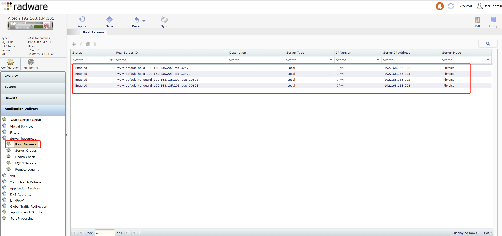
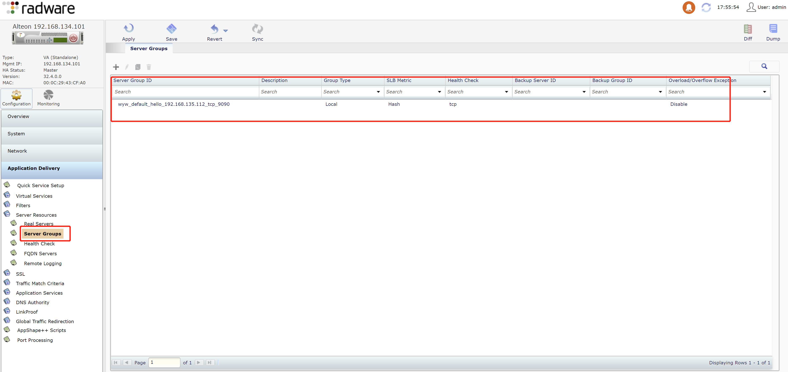
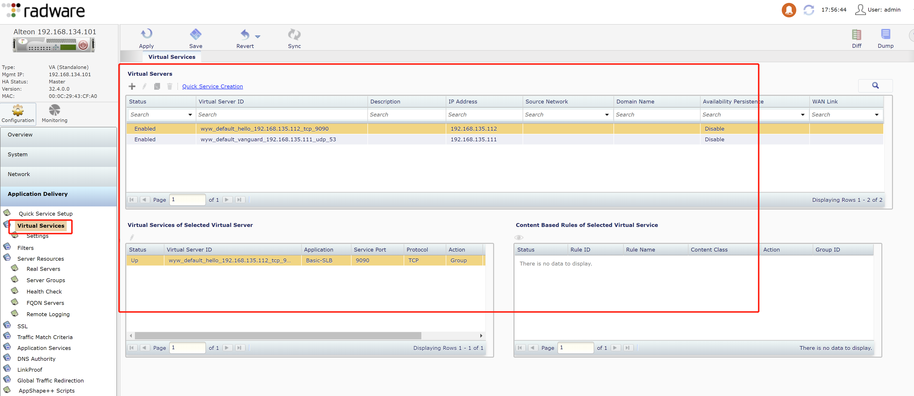

# Radware Alteon Concepts
## concepts
### Real Server
即backend server，主要参数：
* server ip
* server port
在k8s场景中，即LoadBalancer service的nodeport
* 命名规则：{cluster_id}_{namespace_id}_{service_id}_{node_ip}_{nodePort}
### Server Group
realserver集合，表示某项服务所有的后端backend server
主要参数：
* metric：负载均衡算法
* healthcheck：健康检查方法
在k8s l4负载场景下，健康检查方法为lb controller自动设置，根据LoadBalancer service端口类型分别选择tcp或udp端口连通性作为健康检查的方法
* 命名规则：{cluster_id}_{namespace_id}_{service_id}_{service_vip}_{service_port}
### Virtual Server
虚拟服务器，一个nodeport对应一个虚拟机服务器，即理论上一个LoadBalancer service可以拥有多个虚拟服务器
* 命名规则：{cluster_id}_{namespace_id}_{service_id}_{service_vip}_{service_port}
### Virtual Service
虚拟服务，一个nodeport对应一个虚拟服务，理论上一个LoadBalancer类型service可以对应多个虚拟服务
* 命名规则：{cluster_id}_{namespace_id}_{service_id}_{service_vip}_{service_port}
## example
* realserver

* server group

* virtual server&virtual service
