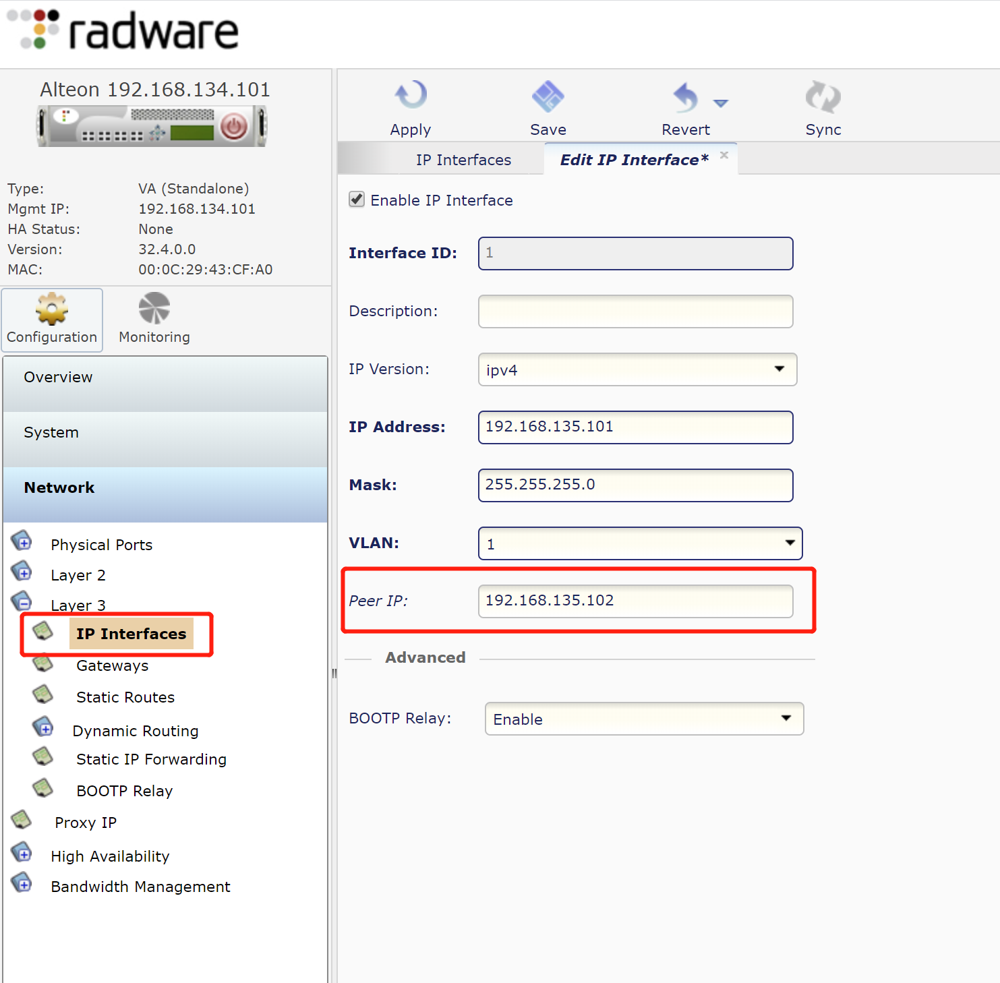
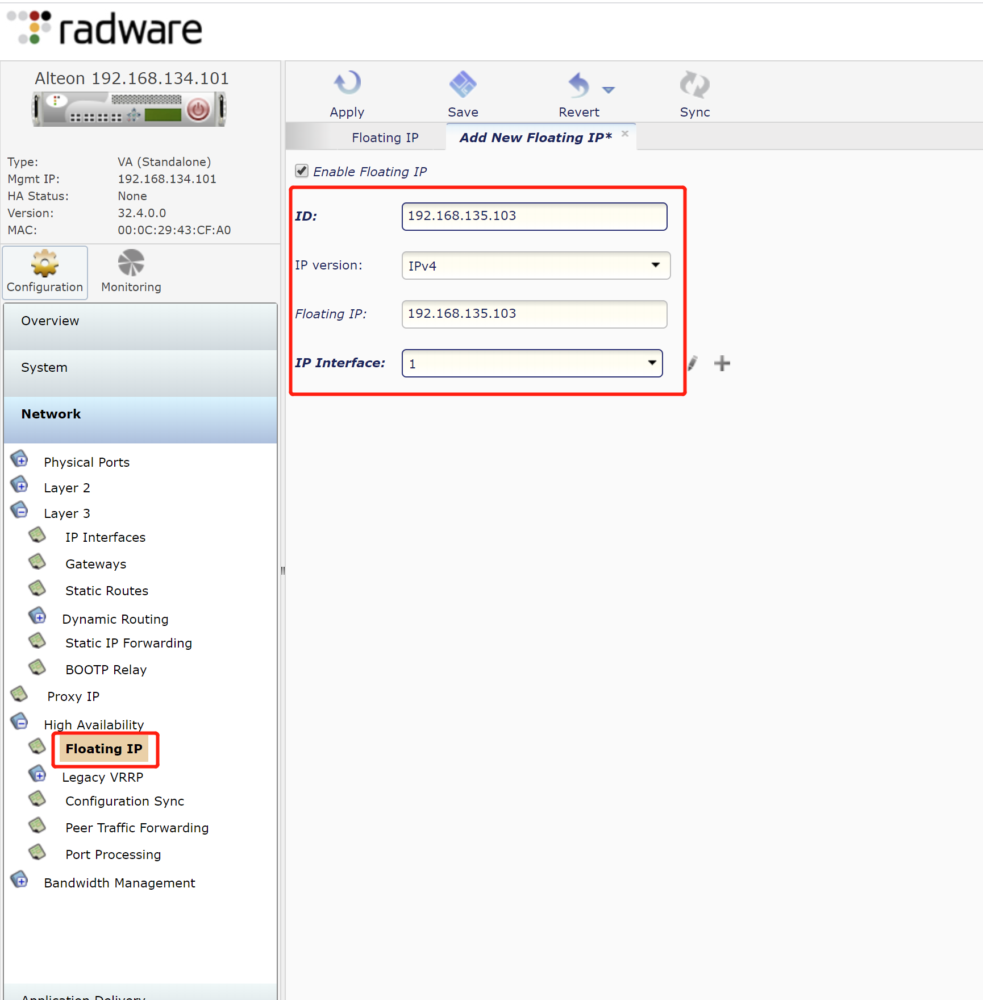
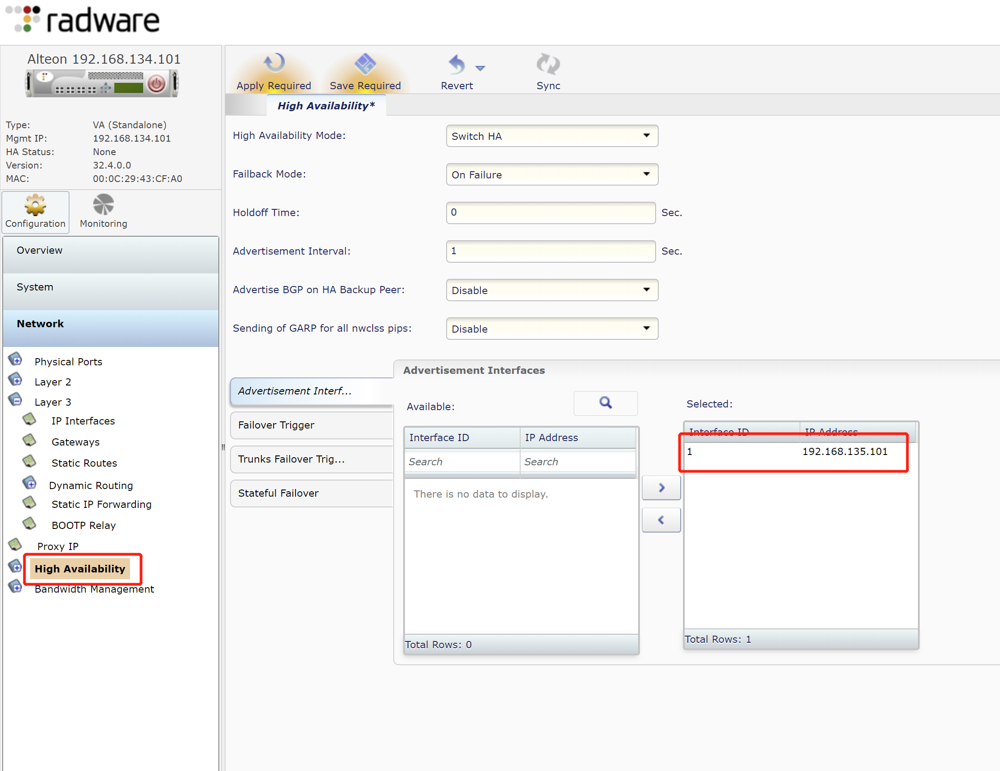
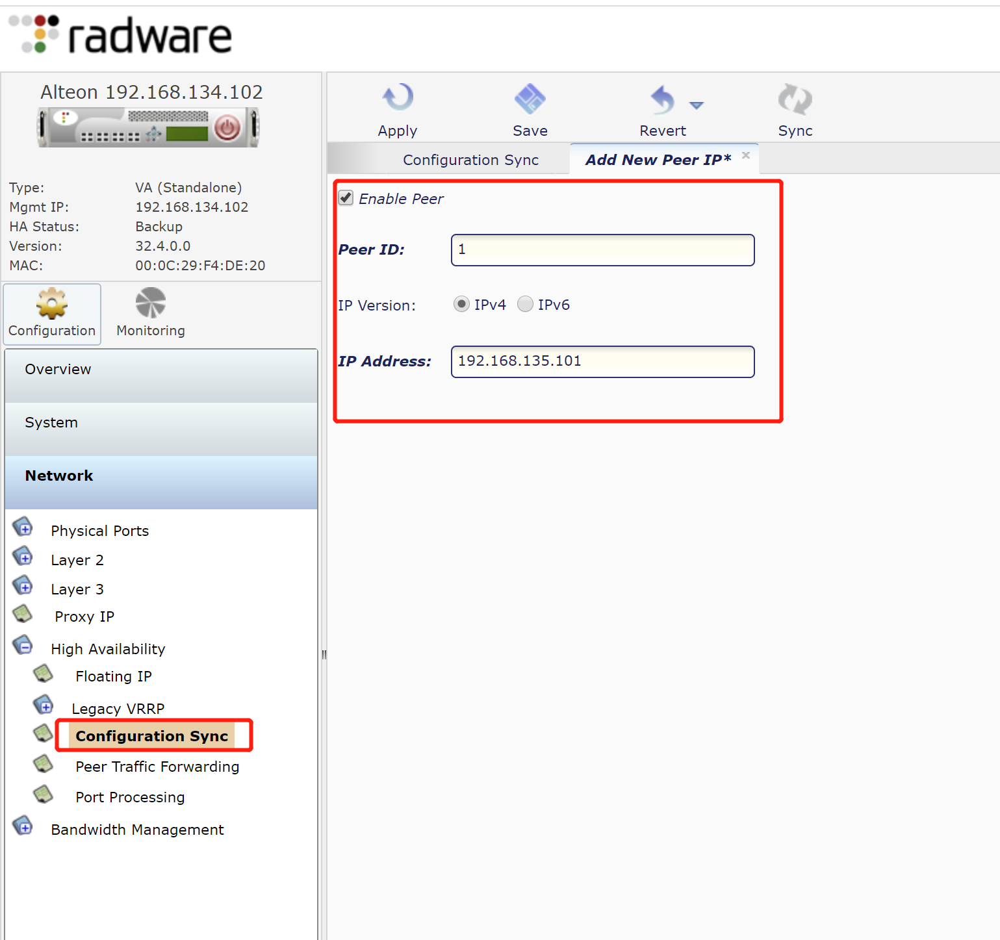
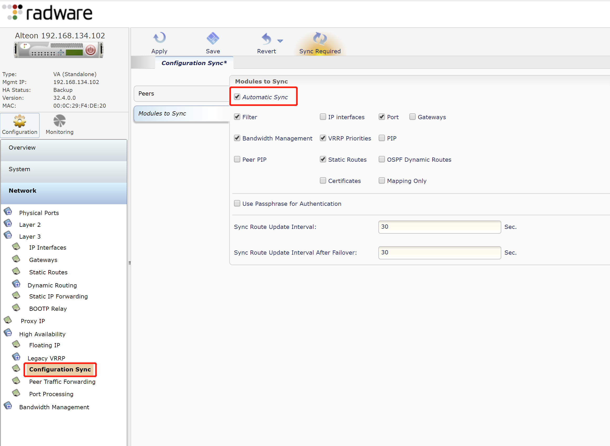
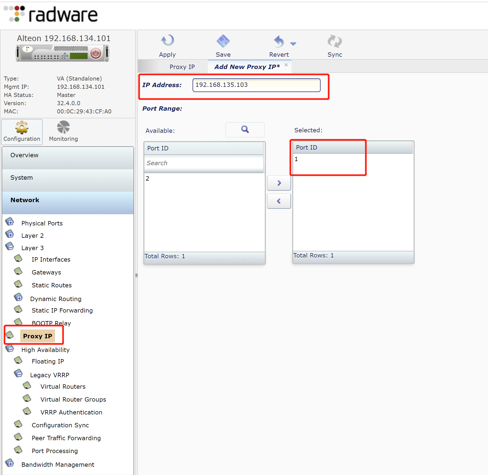
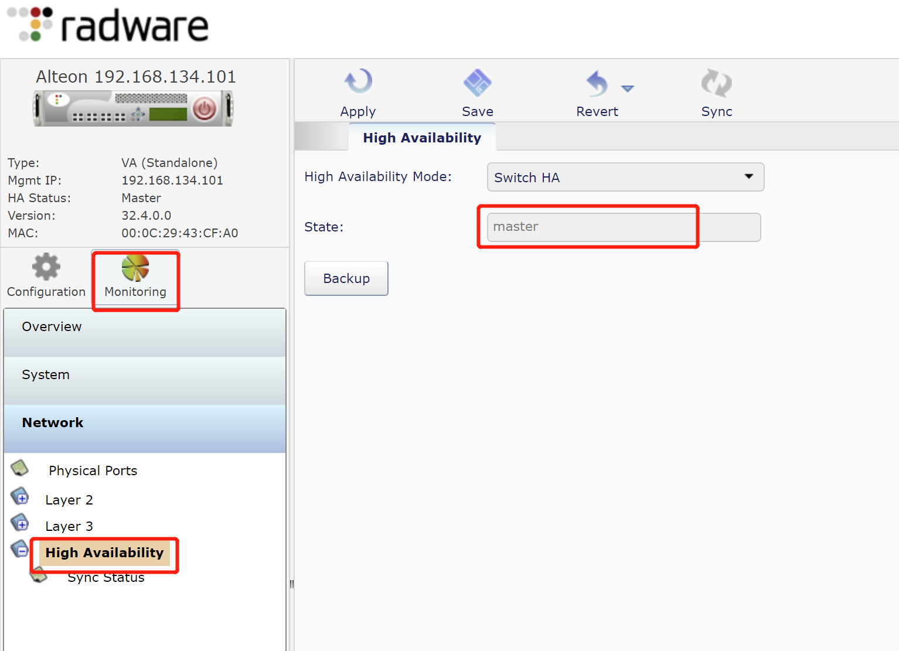

# AlteonOS HA
## 概述
Radware AlteonOS HA分为Switch HA（整机HA）和Service HA（虚拟服务的HA），在此，我们只关注Switch HA
## 前提
* 版本和license一致的AlteonOS设备或虚拟机两台
* 业务虚拟ip规划
## 配置流程
### 配置peer ip
* 定义：另外一台AlteonOS的接口地址
* 配置方法：
Configuratioin > Network > Layer 3 > IP Interfaces

> 注意：主备两台设备都需要配置，配置后需应用和保存
### 配置Floating IP
* 定义：设备的HA虚IP，与Interface IP同段
* 配置方法：
Configuration > Network > High Availability > Floating IP

> 主备两台都需配置
### 配置HA模式
Configuration > Network > High Availability
选择Switch HA

### 配置同步
* 添加Sync Peer
Configuration > Network > High Availability> Configuration Sync

* 启用自动同步
Configuration > Network > High Availability> Configuration Sync

### 配置全局PIP
定义：全局snat地址，建议使用设备ha地址
Configuration > Network > Proxy IP

> 全局pip需两台设备单独进行配置
### HA测试
手动配置一个realserver，等三分钟后，查看备机上是否有相同配置
### 
## HA状态查看
Monitoring > Network > High Availability

