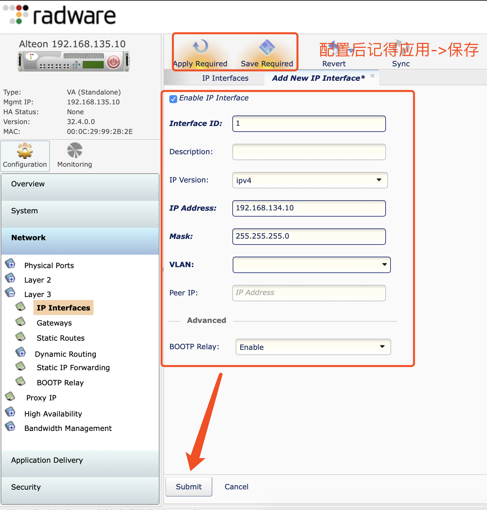
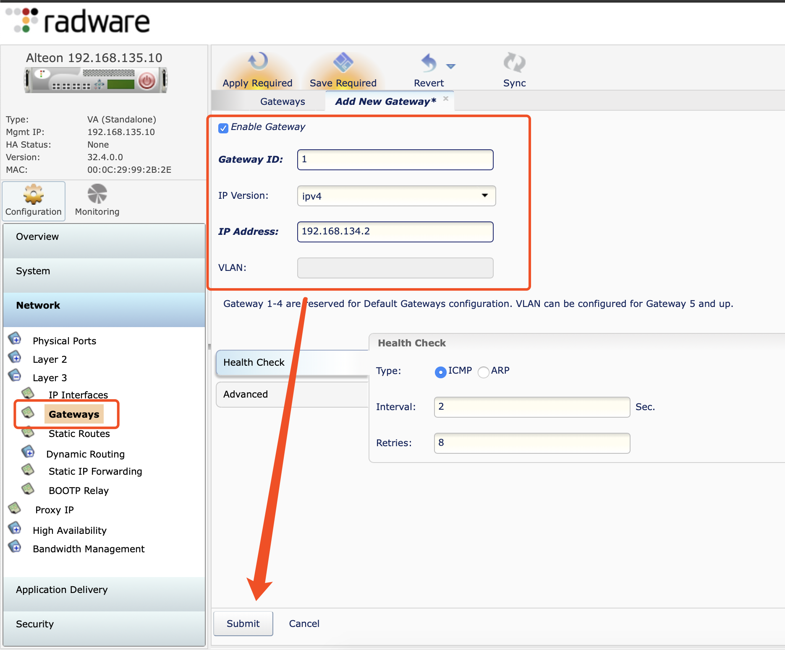

# Radware AlteonOS安装及初始化
## 安装
1. 使用`AlteonOS-32-4-0-0_rls_496.ova`导入的方式创建虚拟机，并修改虚拟机配置
* ova模板默认3张网卡，第一张为管理网卡，第二张和第三张为数据网卡
2. 启动虚拟机，并等待出现提示输入密码
> 初次启动后会提示需要修改admin密码（默认为admin）
## 设置管理网卡
1. 输入安装后设置的admin密码，登入命令行控制台
2. 启用管理网卡并禁用管理网卡dhcp
```sh
cfg/sys/mmgmt/ena
dhcp disable
```
3. 设置管理网卡ip及网关
```sh
addr
gw
```
4. 应用并保存配置
```
apply
save
```
5. 通过ping和浏览器（https）测试虚拟机管理地址是否可访问
## 设置业务网卡
1. 通过浏览器登录radware管理web
2. 选择左侧`Network/Layer 3`菜单，配置业务口地址及网关


